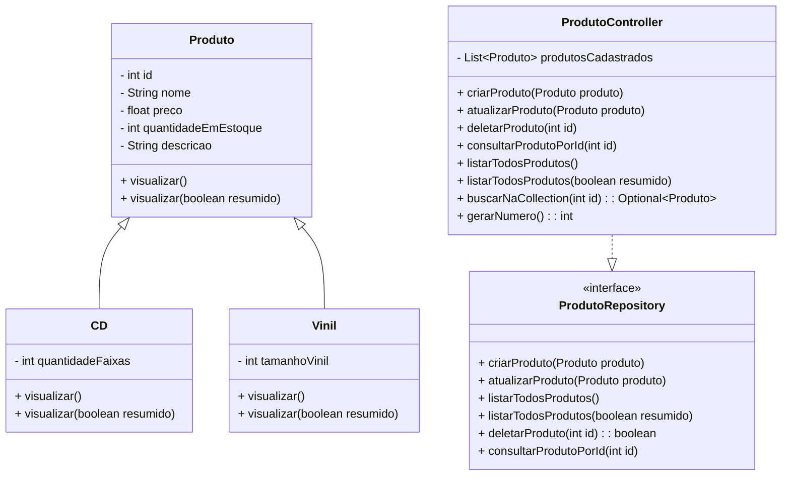

# Sistema de Gerenciamento de Produtos: CDs e Vinis

Este projeto é uma aplicação em Java voltada para o gerenciamento de um e-commerce de produtos musicais, como CDs e Vinis, utilizando os conceitos de orientação a objetos e boas práticas de programação. Foi desenvolvido como projeto final do Bloco 01.


## Funcionalidades

- Cadastrar produtos (CD ou Vinil)
- Atualizar produtos existentes
- Consultar produto por ID
- Excluir produto com confirmação
- Listar todos os produtos

## Estrutura do Projeto

```
projeto_final_bloco_01/
├── model/
│   ├── Produto.java
│   ├── CD.java
│   └── Vinil.java
├── controller/
│   └── ProdutoController.java
├── repository/
│   └── ProdutoRepository.java
├── util/
│   ├── Cores.java
│   └── InputUtils.java
├── Menu.java
└── README.md
```
## Diagrama das classes

</br>

## Conceitos Aplicados

- Encapsulamento com modificadores de acesso
- Herança (Produto como superclasse de CD e Vinil)
- Polimorfismo (visualização e atualização específicas)
- Sobrecarga de métodos (`visualizar()` completo e resumido)
- Uso de `Optional` para evitar `null`
- Manipulação de listas (`ArrayList`)
- Tratamento de exceções com `try/catch`
</br>

## Melhorias Adicionais

- Utilização da classe `InputUtils` para padronizar e tratar entradas de dados (evitando exceções)
- Estrutura visual no console com cores para facilitar a usabilidade
- Mensagens claras e interativas ao usuário
</br>

## Como Executar

1. Clone o repositório:
```bash
git clone https://github.com/renatangr/projeto_final_bloco_01.git
```
2. Importe o projeto em sua IDE Java favorita (ex: Eclipse, IntelliJ)
3. Execute a classe `Menu.java` como aplicação Java
</br>

## Autora

**Renata Negrini**

Email: renatanegrinim@gmail.com.br  
GitHub: [github.com/renatangr](https://github.com/renatangr)

---

🚀 Projeto desenvolvido com fins educacionais para prática de conceitos fundamentais de desenvolvimento de software.
